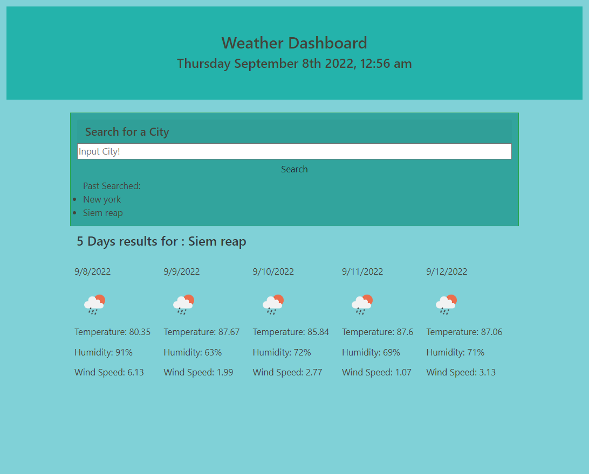

# EZ Weather Forcast 🌟🌌
## This Project is a start from scratch format for Student to build and deployed Weather forcasting application. Student were require to code HTML, write Javascript,Third-partyOpenWeatherAPI, apply CSS style an JavaScript to build webpage to ensure they are functional. Task was to take user input and make call to OpenWeather to retrieve weather data for cities while also feature dynamically updated HTML and CSS to improve the aesthetics for user as well as responsive layout that adapts to different view port.
---
___
## Goal of this Project 
* Create a Weather forcasting application. 
* Use Third-party APIs to allow access to Weather data and functionality by making requests with specific parameters to a URL.
* Use Moment.Js to show current date and time. 
* Take in User input " City " and make call to OpenWeather data base to search for "city" weather data.
* Saved Historical Cities that has been searched. 
* Assign proper Classes and ID while applying Flexes , margin, padding  characteristics to improve aesthetics and looks.  
* Dynamically update HTML and CSS per user input. 
* Deployed Page to Github. 
> I spend most of the time working on setting up HTML for styling, setup Codes and work on Logic to enable my API calls to work with OpenWeather API. Test out calls making sure they append data to screen. After reviewing and receiving recommendation help from Instructor/TAs, the logic became more clear and I was able to made it work. 
---
___

## Project Content

* [Github.com/Young-Chhay/EZWeather-Forcast](https://github.com/Young-Chhay/Young-Challenge-4 "Young's Github Page")

* [Deployed : EZWeather-Forcast](https://young-chhay.github.io/Young-Challenge-4/ "Challenge-4's Webpage")

---
___